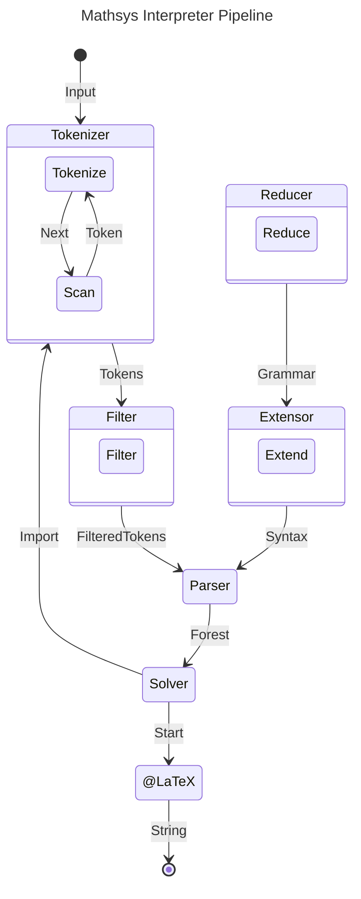

# Mathsys

Mathsys is a Domain-Specific Language (DSL) for mathematical typesetting that is simpler to read and write that other alternatives like LaTeX.

It offers a much more natural syntax that follows how math is written in textfiles, instead of having to use weird notation.

## Usage

1. Install Rust
```bash
curl --proto '=https' --tlsv1.2 -sSf https://sh.rustup.rs | sh
```

2. Install Mathsys
```bash
cargo install mathsys
```

3. Run Mathsys with a file
```bash
cargo run mathsys -- myfile.msm
```

## How it works

The compiling pipeline has multiple phases and is non-linear. Here's a simple overview of it.



### Tokenizer

The tokenizer is a zero-copy, ASCII, bytescanner lexer that iterates over the characters of the input.

This architecture was chosen because it is fast and reliable. It does not support full UTF-8 because it mainly does not need to (no one is writing heart emojis in a textfile, this is not a messaging app).

### Filter

The filter takes the tokenized input and filters for undesirable tokens that do not participate in the lexical analysis in any way, like comments.

The tokenizer does not directly skip these undesirable tokens because syntax highlighting (e.g. for IDEs) needs a tokenstream encompassing the full document span, which the tokenizer provides.

### Reducer

The reducer takes the EBNF-written grammar and lowers it to BNF. This process is delegated to the crate `ebnftobnf` which does so automatically.

### Extensor

The extensor is a simple algorithm that takes a BNF input (the Mathsys grammar) and lowers it to a matrix of elements that acts as a parsing table.

### Parser

The parser is a generalized Earley chart parser with memoization. It is a *generalized* parser because math syntax, by definition, is highly ambiguous.

For example, take the example of `f(0)`. `f(0)` could be both a function call (we are calling `f` with one argument whose value is `0`), or it could be an implicit multiplication expression (we are multiplying the variable `f` with a nested expression containing `0`).

For that reason, Mathsys needs to parse all possible trees in a compact way (a Shared Packed Parse Forest) and then leave tree selection for the following phase.

### Solver

The solver uses a novel algorithm, which I published a [paper](https://doi.org/10.5281/zenodo.21206563) about.

It roughly works as follows:
- It tries to build the main tree (the main pseudonode is guaranteed to only have one derivation).
- When it finds multiple derivations at any point, it compares both derivations by building element by element in each individual subtree and comparing them against each other.
- For example, in the `f(0)` example, it would mean that the two factors are built and then the "right" one is selected based on a global mutable context. In practice, it would mean that if `f` was previously initialized as a function, then it would resolve to the function call, and otherwise it would default to the implicit multiplication.
- It repeats until the tree has been fully built.

### LaTeX

Finally, once the `Start` node has been built, a method on it is called to be rendered as LaTeX which calls recursively all other nodes in the tree.